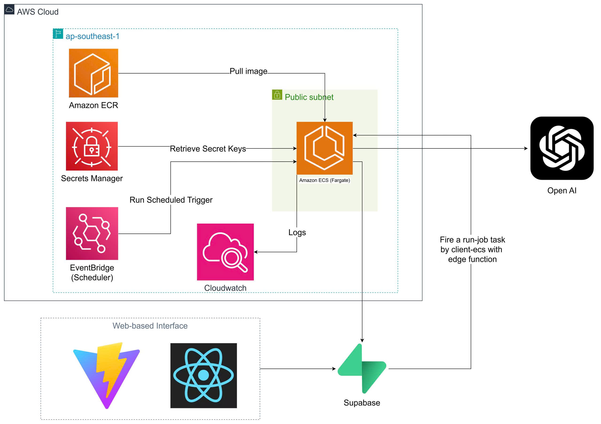
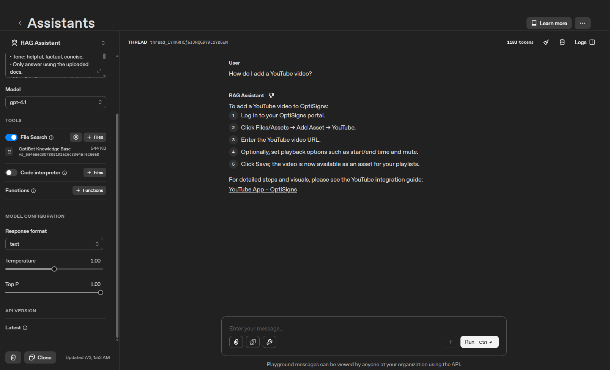
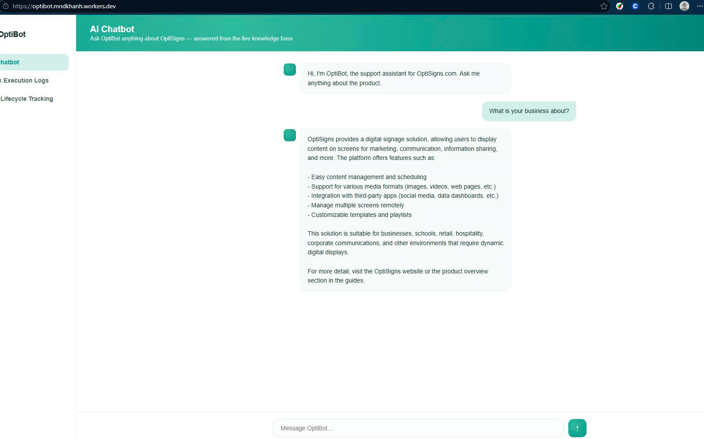

# Support-Docs RAG Assistant

A support-chatbot clone backed by a real Zendesk Help Center knowledge base.

## Setup

```bash
cd scraper
cp ../.env.sample ../.env
# fill in OPENAI_API_KEY at minimum
pip install -r requirements.txt
```

## Run locally

```bash
cd scraper
python main.py
```

Or via Docker:

```bash
cd scraper
docker build -t rag-assistant .
docker run --rm \
  -e OPENAI_API_KEY=sk-... \
  -e VECTOR_STORE_ID=vs_... \
  -v "$(pwd)/data:/app/data" \
  rag-assistant
```

## Chunking Strategy

I choose the default chunking strategy of Open AI vector store for some reasons:

- It has 800 token/chunk and 400 token/overlap, it will help to prevent AI LLM to hallucinate about the context. It still has surrounding context in the adjacent chunk.
- For convenience and simplicity/readability over a heading-aware splitter.

## Daily job logs & Architecture



https://optibot.mndkhanh.workers.dev/

## Sample answer

Prompt: "How do I add a YouTube video?"



Prompt: "What is your business about?"


